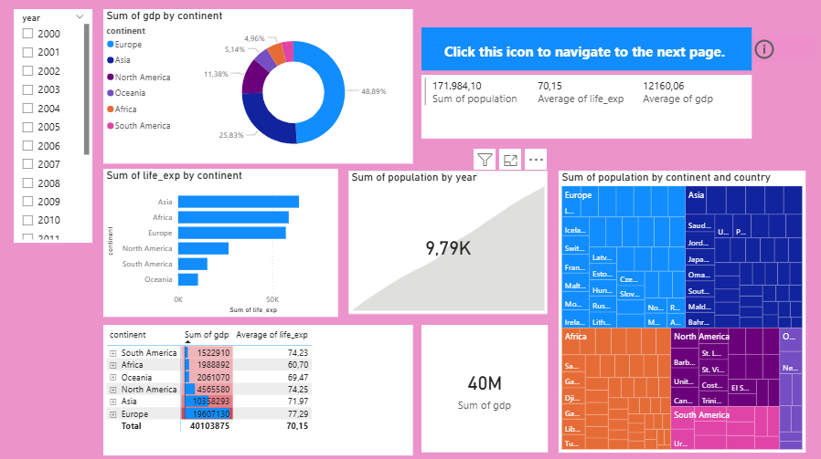
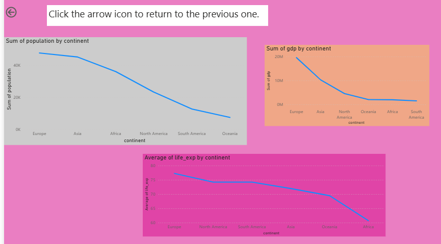

# 📊 Data Analyst Full Course

A comprehensive portfolio showcasing my journey in learning **Data Analytics** using industry-standard tools such as **Microsoft Excel, Python, SQL, PostgreSQL, SQL Server, and Power BI**.

This repository demonstrates the complete data analysis workflow—from data preparation and cleaning to exploratory data analysis (EDA), SQL querying, data visualization, and interactive dashboard development.

---

## 👋 About This Repository

This repository was created to document my learning journey and hands-on practice as an aspiring **Data Analyst**.

It contains notebooks, SQL scripts, Excel exercises, datasets, and Power BI dashboards that demonstrate the essential technical skills required in data analytics.

Throughout this repository, I focus on applying data analysis techniques to transform raw data into meaningful insights using modern analytical tools.

---

# 💼 Core Skills

- 📊 Microsoft Excel
- 🐍 Python
- 🐼 Pandas
- 🔢 NumPy
- 📈 Matplotlib
- 📉 Seaborn
- 🗄 SQL
- 🐘 PostgreSQL
- 🖥 SQL Server
- 📊 Power BI
- 🧹 Data Cleaning
- 📈 Exploratory Data Analysis (EDA)
- 📊 Dashboard Design
- 📑 Business Reporting

---

# 📂 Repository Structure

```text
📁 Data Python/
│
├── datasets
├── notebooks
│
📁 data sql/

📄 Excel for Data Analyst.xlsx
📄 Python_Fundamentals.ipynb
📄 Pandas_for_Data_Analyst.ipynb
📄 Numpy_and_Data_Manipulation.ipynb
📄 Matplotlib_for_Data_Visualization.ipynb
📄 Seaborn_for_Statistical_Data_Visualization.ipynb
📄 SQL_for_Data_Analytics.sql
📄 Power BI for Data Analyst.pbix
📄 README.md
```

---

# 📊 Dataset

The repository contains sample datasets used for:

- Data Cleaning
- Data Transformation
- Exploratory Data Analysis
- SQL Practice
- Data Visualization
- Dashboard Development

The datasets are intended for educational purposes and demonstrate real-world analytical workflows.

---

# 📑 Excel for Data Analysis

The Excel workbook demonstrates fundamental spreadsheet skills commonly used by Data Analysts, including:

- Data Entry
- Data Formatting
- Sorting & Filtering
- Conditional Formatting
- Lookup Functions
- Pivot Tables
- Charts
- Basic Data Analysis

---

# 🐍 Python for Data Analysis

The Python notebooks cover fundamental programming concepts and data analysis techniques using popular libraries.

Topics include:

- Python Fundamentals
- Variables & Data Types
- Functions
- Loops
- Conditional Statements
- Pandas
- NumPy
- Data Manipulation
- Data Cleaning
- Exploratory Data Analysis (EDA)

---

# 📈 Data Visualization

Visualization notebooks demonstrate how to communicate insights effectively using Python libraries.

Tools used:

- Matplotlib
- Seaborn

Visualization topics include:

- Line Charts
- Bar Charts
- Scatter Plots
- Histograms
- Boxplots
- Correlation Heatmaps
- Distribution Analysis

---

# 🗄 SQL for Data Analytics

SQL exercises are written using standard SQL syntax and can be executed in:

- PostgreSQL
- SQL Server

Topics include:

- SELECT
- WHERE
- ORDER BY
- GROUP BY
- HAVING
- JOIN
- CASE WHEN
- Aggregate Functions
- Common Table Expressions (CTE)
- Window Functions
- Subqueries

---

# 📊 Power BI Dashboard.

This repository includes an interactive Power BI dashboard that presents key insights through multiple visualizations and interactive reports.

---

## 📄 Dashboard Overview – Page 1

The first dashboard page provides an executive summary of the dataset, including:

- KPI Cards
- Population by Year
- GDP by Continent
- Life Expectancy by Continent
- Treemap Visualization
- Interactive Year Filter

<p align="center">
  
</p>

---

## 📄 Dashboard Overview – Page 2

The second dashboard focuses on trend analysis across continents.

Visualizations include:

- Population by Continent
- GDP by Continent
- Average Life Expectancy by Continent

<p align="center">
  
</p>

---

### Dashboard File

The original Power BI dashboard can be opened using:

```
Power Bi for Data Analyst.pbix
```

Open it with **Microsoft Power BI Desktop**.

# 🚀 Learning Workflow

The overall workflow followed throughout this repository:

### 1️⃣ Data Collection

- Import datasets
- Understand dataset structure
- Inspect variables

### 2️⃣ Data Preparation

- Data Cleaning
- Handle Missing Values
- Remove Duplicates
- Data Formatting

### 3️⃣ Exploratory Data Analysis (EDA)

- Summary Statistics
- Distribution Analysis
- Outlier Detection
- Correlation Analysis
- Feature Exploration

### 4️⃣ SQL Analysis

- Query datasets
- Aggregate information
- Join multiple tables
- Generate business insights

### 5️⃣ Data Visualization

- Create charts
- Explore trends
- Compare categories
- Present findings visually

### 6️⃣ Dashboard Development

- Import data into Power BI
- Create relationships
- Design interactive dashboards
- Present business insights

---

# 🎯 Learning Outcomes

Through this repository, I have developed practical experience in:

- ✅ Microsoft Excel for data preparation
- ✅ Python programming
- ✅ Data Cleaning
- ✅ Data Transformation
- ✅ Exploratory Data Analysis (EDA)
- ✅ SQL Query Development
- ✅ Database Analysis
- ✅ Data Visualization
- ✅ Power BI Dashboard Development
- ✅ Business Insight Generation

---

# 🛠 Tools & Technologies

| Category | Tools |
|-----------|-------|
| Spreadsheet | Microsoft Excel |
| Programming | Python |
| Libraries | Pandas, NumPy |
| Visualization | Matplotlib, Seaborn |
| Database | PostgreSQL, SQL Server |
| Query Language | SQL |
| Business Intelligence | Power BI |
| Development Environment | Jupyter Notebook |

---

# ▶️ How to Run

### 1. Clone this repository

```bash
git clone https://github.com/SubaerVernandes/Data-Analyst-Full-Course.git
```

### 2. Install required Python libraries

```bash
pip install pandas numpy matplotlib seaborn
```

### 3. Open the Jupyter Notebooks

Run the notebooks sequentially to explore Python programming, data manipulation, and visualization.

### 4. Execute SQL Scripts

Run the SQL scripts using PostgreSQL or SQL Server.

### 5. Explore Excel Exercises

Open the Excel workbook to review spreadsheet-based data analysis techniques.

### 6. Open the Power BI Dashboard

Use **Power BI Desktop** to open the `.pbix` file and interact with the dashboard.

---


# 👨‍💻 About Me

**Faris Fatur Rohman**

Mathematics Undergraduate | Aspiring Data Analyst

I am passionate about transforming raw data into meaningful insights using **Excel, Python, SQL, and Power BI**. I continuously build practical projects to strengthen my analytical skills and prepare for a professional career in Data Analytics.

---

# 📫 Connect With Me

- **GitHub:** https://github.com/SubaerVernandes

---

⭐ **If you find this repository useful, feel free to star it and follow my GitHub for future Data Analytics projects!**
